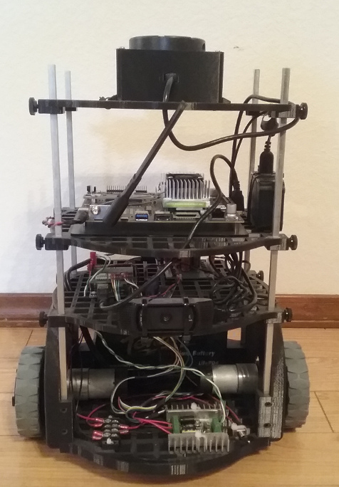

# ROS_HouseBot

This is a repo for a house robot built on ROS.  It was leveraged from the design idea of the turtlebot.  It is modular and has movable shelves to experiment with various sensors and positions.  The purpose is to experiment with sensors and learn about computer vision and navigation in the home or office environment. 

### Parts List

* Jetson TX2 - https://developer.nvidia.com/embedded/buy/jetson-tx2
* Arduino Mega - https://store.arduino.cc/usa/mega-2560-r3 
* RoboGaia Encoder Shield - https://www.robogaia.com/3-axis-encoder-conter-arduino-shield.html 
* Sabertooth DC Motor Driver - https://www.dimensionengineering.com/products/sabertooth2x12
* 12V DC Motors with encoders - https://www.dfrobot.com/product-777.html
* 12V Lithium Iron Battery - https://www.amazon.com/Battery-Tender-BTL35A480C-Lithium-Phosphate/dp/B00F9LPL5E
* VX-11 Lidar - https://www.getsurreal.com/product/xv-lidar-sensor-mount-package/
* Logitech 920C Webcam - https://www.amazon.com/Logitech-Widescreen-Calling-Recording-Desktop/dp/B006JH8T3S 
* 9DOF IMU - https://www.adafruit.com/product/2472 

### System Architecture

This is built on ROS Melodic and has several native libraries and ones built from previous ROS versions.

### Options

The main controller selected was the Jetson TX-2 board.  I got one at a discount from being in Udacity's Self-Driving Car ND.  Other options for the controller board could be a Raspberry Pi3 B or the new NVIDIA Nano.

### Installation

Jetpack 4.2 was installed on the Jetson TX-2 board following the instructions:

Installer: https://developer.nvidia.com/embedded/dlc/nv-sdk-manager   
Instructions 1 (Download/Run): http://docs.nvidia.com/sdk-manager/download-run-sdkm/index.html   
Instructions 2 (Install Software to Jetson):http://docs.nvidia.com/sdk-manager/install-with-sdkm-jetson/index.html

I got an error in the installer compiling and loading opencv.  The OS had been installed, so I completed the setup of the OS and logged into the system.  I then finished the installation of CUDA and the other components.

Download and Compile OpenCV:   
https://jkjung-avt.github.io/opencv3-on-tx2/ 

Installing ROS:   
Following ROS Melodic install: http://wiki.ros.org/melodic/Installation/Ubuntu 

Installed ROS Base:   
$ sudo apt install ros-melodic-ros-base

Installed components:   
$ sudo apt-get install ros-melodic-nav-core ros-melodic-nav2d   
$ sudo apt-get install ros-melodic-rosserial-python ros-melodic-rosserial-server   
$ sudo apt-get install ros-melodic-tf2 ros-melodic-tf2-ros   
$ sudo apt-get install ros-melodic-amcl ros-melodic-global-planner ros-melodic-costmap-2d   
$ sudo apt-get install ros-melodic-move-base   
$ sudo apt-get install ros-melodic-roslint   
$ sudo apt-get install ros-melodic-image-transport ros-melodic-compressed-image-transport   
$ sudo apt-get install ros-melodic-camera-info-manager   
$ sudo apt-get install ros-melodic-vision-opencv   
$ sudo apt-get install ros-melodic-image-pipeline   
$ sudo apt-get install ros-melodic-tf-conversions   
$ sudo apt-get install ros-melodic-diagnostic-updater   
$ sudo apt-get install ros-melodic-geographic-msgs   
$ sudo apt-get install ros-melodic-cartographer   

Some components are not native under ROS Melodic, so you have to download the packages and compile them on the system.  You can also compile them if you want to modify the code and maybe contribute to the packages.

Packages downloaded and compiled:
* robot_upstart - https://github.com/clearpathrobotics/robot_upstart 
* imu_compass - https://github.com/clearpathrobotics/imu_compass 
* vision_opencv - https://github.com/ros-perception/vision_opencv 
* image_pipeline - https://github.com/ros-perception/image_pipeline
* hector_slam - https://github.com/tu-darmstadt-ros-pkg/hector_slam 
* xv_11_laser_driver - https://github.com/rohbotics/xv_11_laser_driver

